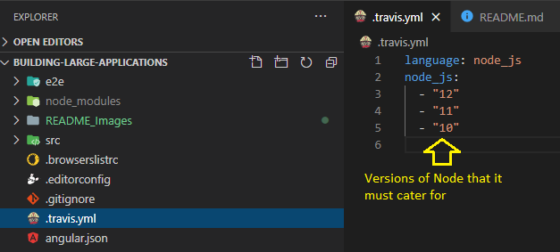
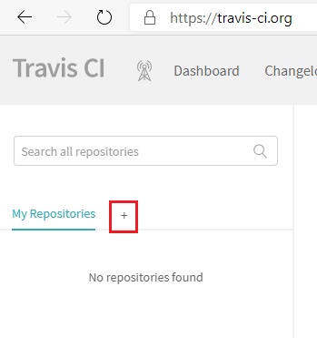
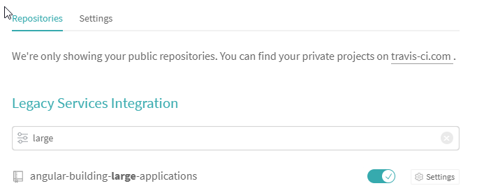

# Building Large Applications

[Github Repo](https://github.com/jarrod-kallis/angular-building-large-applications)

## Travis CI

[Website](https://travis-ci.org/)
Sign in with GitHub account

### .travis.yml

### On the Travis Website

#### Add To Repo

#### Add To Travis

#### Sync Account

 
This should start building the project automatically, or you can trigger a build, or you can make a change and push it to the GitHub repo
